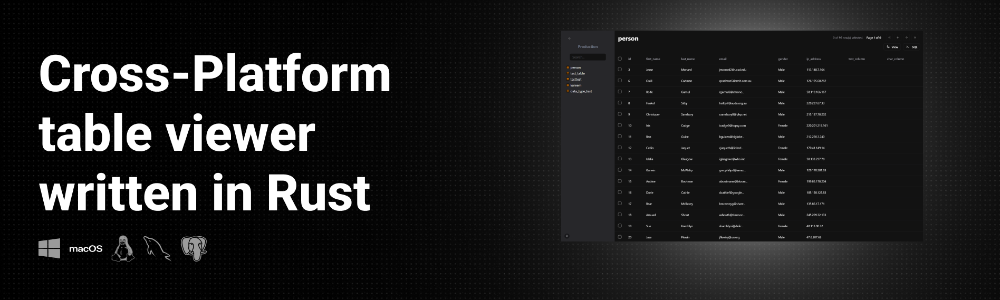

  

  
  

Download and try TableX from the [official website](https://tablex-tan.vercel.app)

## About the Project 🎯

Tablex aims at delivering a fast, user friendly, productive and **free** database browsing experience.

While not claiming that it is a replacement of any other tool, it strives to provide a new way of dealing with databases.

## Features ✨

- `Cross-Platform`: supports Windows, MacOS and Linux with a variety of architectures.
- `Multi-DB support`: supports PostgreSQL, MySQL and SQLite.
- `Settings & Keybindings`: configurable settings and keybindings inspired by VSCode.
- `Automatic API docs`: Auto generate RESTfull and GraphQL endpoints for your database inspired by Supabase.
- `Built-in updater`: TableX can self update with our built-in updater.
- `Accessibility`: you will find utilities that improve your experience.
- `CLI`: Use TableX from right withing your terminal.

## Tech Stack ⌨️

- [Tauri](https://tauri.app/) :
  - [React](https://react.dev/) + [Vite](https://vitejs.dev/) : Frontend
  - [Rust](https://www.rust-lang.org/) : Backend
- [Tailwind](https://tailwindcss.com/) : CSS Framework
- [Tanstack](https://tanstack.com/) : [Router](https://tanstack.com/router/latest), [Query](https://tanstack.com/query/latest), [Table](https://tanstack.com/table/v8), [Virtual](https://tanstack.com/virtual/latest)
- [Zustand](https://zustand-demo.pmnd.rs/): State management
- [Astro](https://astro.build/) + [Starlight](https://starlight.astro.build/) : Website and Docs
- [Golang](https://go.dev) : [MetaX](https://github.com/kareemmahlees/meta-x)
- [shadcn/ui](https://ui.shadcn.com/) : Components
- [Changesets](https://github.com/changesets/changesets): Versioning and Changelogs
- [Vercel](https://vercel.com/) : Deployment

## Contributing 🫱🏻‍🫲🏻

please refer to [Contributing](https://tablex-tan.vercel.app/contributing).

## Contributors

<!-- ALL-CONTRIBUTORS-LIST:START - Do not remove or modify this section -->
<!-- prettier-ignore-start -->
<!-- markdownlint-disable -->
<table>
  <tbody>
    <tr>
      <td align="center" valign="top" width="14.28%"><a href="https://kareem-ebrahim.vercel.app/"> <b>Kareem Ebrahim</b></a> <a href="https://github.com/kareemmahlees/tablex/commits?author=kareemmahlees" title="Code">💻</a></td>
      <td align="center" valign="top" width="14.28%"><a href="http://diffingdiffs.blogspot.com"> <b>David Barnett</b></a> <a href="https://github.com/kareemmahlees/tablex/commits?author=dbarnett" title="Code">💻</a> <a href="https://github.com/kareemmahlees/tablex/commits?author=dbarnett" title="Documentation">📖</a></td>
    </tr>
  </tbody>
</table>

<!-- markdownlint-restore -->
<!-- prettier-ignore-end -->

<!-- ALL-CONTRIBUTORS-LIST:END -->
<!-- prettier-ignore-start -->
<!-- markdownlint-disable -->

<!-- markdownlint-restore -->
<!-- prettier-ignore-end -->

<!-- ALL-CONTRIBUTORS-LIST:END -->
