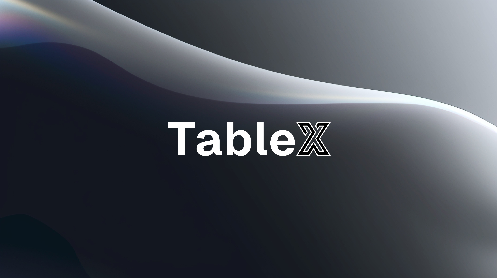

  

  
  

> [!NOTE]
> 🚧
> TableX is still under development, don't expect it to be perfect, yet.

Checkout [Changleogs](./apps/core/CHANGELOG.md) and our [issues](https://github.com/kareemmahlees/tablex/issues) section.

## Don't Waste time, try it NOW 💥

Head to TableX's [official website](https://tablex-tan.vercel.app/) and download the executable of your choice.

## About the Project

Tablex aims at delivering a fast, user friendly, productive and **free** database browsing experience.

While not claiming that it is a replacement of any other tool, yet, it strives to provide a, hopefully, good user experience.

## What Does it offer ✨

- Delightful user experience
- Top-Notch performance with pagination and virtualization
- Support for SQLite, PostgreSQL, MySQL
- Available for Windows, MacOS, and Linux
- A CLI to boost your workflow
- Automatically create a RESTfull and GraphQL APIs for your database
- Keyboard shortcuts for productivity homies
- Free and Open-Source

## Announcements 🎉

### v0.3.7

- You can now write Raw SQL withing TableX directly.

### v0.3.6

- TableX now supports Foreign key relations 🔗.

## Tech Stack ⌨️

- [Tauri](https://tauri.app/) :
  - [React](https://react.dev/) + [Vite](https://vitejs.dev/) : Frontend
  - [Rust](https://www.rust-lang.org/) : Backend
- [Tailwind](https://tailwindcss.com/) : CSS Framework
- [Tanstack](https://tanstack.com/) : [Router](https://tanstack.com/router/latest), [Query](https://tanstack.com/query/latest), [Table](https://tanstack.com/table/v8), [Virtual](https://tanstack.com/virtual/latest)
- [Astro](https://astro.build/) : Website
- [Golang](https://go.dev) : [MetaX](https://github.com/kareemmahlees/meta-x)
- [shadcn/ui](https://ui.shadcn.com/) : Components
- [Changesets](https://github.com/changesets/changesets): Versioning and Changelogs
- [Vercel](https://vercel.com/) : Deployment

<!-- ## Keyboard Shortcuts -->

<!-- | Shortcut                       | Description                       |
| ------------------------------ | --------------------------------- |
| <kbd>Ctrl</kbd> + <kbd>k</kbd> | open command palette              |
| <kbd>Ctrl</kbd> + <kbd>s</kbd> | focus search input                |
| <kbd>Ctrl</kbd> + <kbd>a</kbd> | select or deselect all            |
| <kbd>Ctrl</kbd> + <kbd>c</kbd> | copy selected rows into clipboard |
| <kbd>Delete</kbd>              | delete selected rows              | -->

## Contributing 🫱🏻‍🫲🏻

please refer to [CONTRIBUTING.md](./docs/CONTRIBUTING.md)

## Contributors

<!-- ALL-CONTRIBUTORS-LIST:START - Do not remove or modify this section -->
<!-- prettier-ignore-start -->
<!-- markdownlint-disable -->
<table>
  <tbody>
    <tr>
      <td align="center" valign="top" width="14.28%"><a href="https://kareem-ebrahim.vercel.app/"> <b>Kareem Ebrahim</b></a> <a href="https://github.com/kareemmahlees/tablex/commits?author=kareemmahlees" title="Code">💻</a></td>
      <td align="center" valign="top" width="14.28%"><a href="http://diffingdiffs.blogspot.com"> <b>David Barnett</b></a> <a href="https://github.com/kareemmahlees/tablex/commits?author=dbarnett" title="Code">💻</a> <a href="https://github.com/kareemmahlees/tablex/commits?author=dbarnett" title="Documentation">📖</a></td>
    </tr>
  </tbody>
</table>

<!-- markdownlint-restore -->
<!-- prettier-ignore-end -->

<!-- ALL-CONTRIBUTORS-LIST:END -->
<!-- prettier-ignore-start -->
<!-- markdownlint-disable -->

<!-- markdownlint-restore -->
<!-- prettier-ignore-end -->

<!-- ALL-CONTRIBUTORS-LIST:END -->
